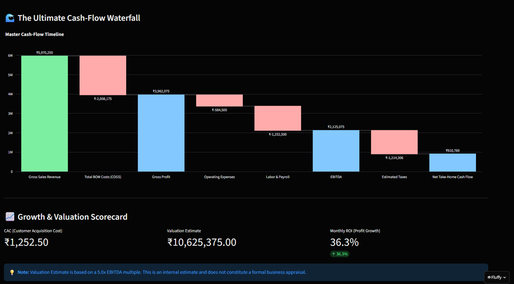

# 📊 MenuMetrics-AI (Enterprise Financial Cockpit)



🔥 **Live Web Demo:** [Play Here](https://menumetrics-ai.onrender.com)
> **Note:** The live demo is hosted on a free Render tier. If it hasn't been visited in 15 minutes, it will spin down to save resources. **It may take 30-60 seconds to wake up** on your first visit. Please be patient!

## 🚀 Overview
MenuMetrics-AI is an enterprise-grade, one-stop financial operating system built for modern businesses. It empowers business owners and executives to bypass traditional spreadsheets by offering real-time financial intelligence, machine learning-powered price optimization, and deep inventory analytics.

Designed as a globally accessible Progressive Web App (PWA), MenuMetrics-AI runs flawlessly across Desktop, Android, and iOS. It features **Fluffy**, a built-in offline Q&A assistant that lets you check your financial data using simple keyword queries — no internet or API keys required.

## 🛠️ Tech Stack
- **Language:** Python 3.10+
- **Frontend / Framework:** Streamlit (Cross-Platform PWA)
- **Data Engineering:** Pandas & NumPy
- **Machine Learning:** Scikit-Learn (Price Elasticity & Optimization)
- **Data Visualization:** Plotly (Interactive Charts)
- **Database Architecture:** SQLAlchemy & PostgreSQL (Enterprise Cloud Sync)

## ✨ Key Features
- **Machine Learning Price Optimization:** Automatically simulate and predict the exact optimal selling price for any product to maximize profit margins based on historical elasticity.
- **Automated Financial Intelligence:** Real-time, instant calculation of EBITDA, OpEx burn rates, COGS alerts, Net Profit After Tax (NPAT), and Tax Escrows.
- **Fluffy // Financial Q&A Assistant:** Ask Fluffy about your net profit, tax escrow, revenue, labor costs, or top-selling items using simple keyword-based queries, and get instant answers pulled straight from your live dashboard data.
- **Enterprise Cloud Sync:** Seamlessly teleport your active inventory dataset directly to your company's private PostgreSQL database.
- **Cross-Platform PWA:** A beautiful, responsive, dark-mode glowing aesthetic that can be installed directly to your iPhone or Android home screen.

## 📱 Getting Started
To run this project locally on your machine:

**1. Clone the repository:**
```bash
git clone https://github.com/ArghyaBhattacharya123/MenuMetrics-AI.git
cd MenuMetrics-AI
```

**2. Install Dependencies:**
```bash
pip install -r requirements.txt
```

**3. Launch the Application:**
```bash
streamlit run app.py
```
*(The application will automatically open in your default web browser at `http://localhost:8501`)*

## 📄 License
This project is licensed under the **MIT License** - meaning it is fully open-source and free to fork, modify, or use in commercial enterprise settings.
